# Вас приветствует Mr712

> **Language:** Русский · [English](README.en.md)

Разработчик модов для Minecraft, приложений, консольных утилит и иных инструментов.

## 📊 Активность и статистика профиля

  

  

## 🗂️ Каталог моих проектов

<b>Minecraft моды (Fabric 1.21.4)</b>

 

| Мод | Описание |
|---|---|
| **[AdaptiveTooltips](https://github.com/byMr712/AdaptiveTooltips-1.21.4-MinecraftMod)** | Сборка мода AdaptiveTooltips для Minecraft 1.21.4 |
| **[Bountiful](https://github.com/byMr712/Bountiful-1.21.4-MinecraftMod)** | Сборка мода Bountiful для Minecraft 1.21.4 |
| **[Tiered](https://github.com/byMr712/Tiered-1.21.4-MinecraftMod)** | Сборка мода Tiered для Minecraft 1.21.4 |
| **[ExlineCoppeRequipment](https://github.com/byMr712/ExlineCoppeRequipment-1.21.4-MinecraftMod)** | Сборка мода ExlineCoppeRequipment для Minecraft 1.21.4 с исправлением спама в логах |
| **[FancyToasts](https://github.com/byMr712/FancyToasts-1.21.4-MinecraftMod)** | Сборка новой версии мода FancyToasts с исправлениями для Minecraft 1.21.4 |
| **[RecipeEditor](https://github.com/byMr712/RecipeEditor-1.21.4-MinecraftMod)** | Мод для добавления целой системы изменения рецептов крафта для Minecraft 1.21.4 |
| **[MoreLapisLazuli](https://github.com/byMr712/MoreLapisLazuli-1.21.4-MinecraftMod)** | Сборка мода MoreLapisLazuli для Minecraft 1.21.4 |
| **[Spears](https://github.com/byMr712/Spears-1.21.4-MinecraftMod)** | Сборка мода Spears для Minecraft 1.21.4 |
| **[ViaFabricPlusBackPort](https://github.com/byMr712/ViaFabricPlusBackPort-1.21.4-MinecraftMod)** | Сборка мода ViaFabricPlus для Minecraft 1.21.4 с доступными новыми версиями для подключения до 26.3 |
| **[Modded2Vanilla](https://github.com/byMr712/Modded2Vanilla-1.21.4-MinecraftMod)** | Клиентский мод для Minecraft 1.21.4 (Fabric), устраняющий разногласия модифицированного клиента с пользовательскими серверами. |
| **[Nvidium](https://github.com/byMr712/Nvidium-1.21.4-MinecraftMod)** | Сборка мода Nvidium для Minecraft 1.21.4 |
| **[SimpleElytraHudExtended](https://github.com/byMr712/SimpleElytraHudExtended-1.21.4-MinecraftMod)** | Сборка мода SimpleElytraHud для Minecraft 1.21.4 с поддержкой элитр из модов |
| **[MoreModernStructures](https://github.com/byMr712/MoreModernStructures-1.21.4-MinecraftMod)** | Мод для генерации в мире новых построек-структур в стиле модерн домов для Minecraft 1.21.4 |
| **[RDPMouse](https://github.com/byMr712/RDPMouse-1.21.4-MinecraftMod)** | Сборка новой мода RDPMouse для Minecraft 1.21.4 |
| **[MouseNavigation](https://github.com/byMr712/MouseNavigation-1.21.4-MinecraftMod)** | Клиентский мод для Minecraft 1.21.4 (Fabric), позволяет клавишами вверх/вниз на вашей мыши управлять окнами интерфейса и не только, не мешая работе мыши в самой игре |
| **[MielonsTheSift](https://github.com/byMr712/MielonsTheSift-1.21.4-MinecraftMod)** | Сборка мода Mielon's The Sift для Minecraft 1.21.4 |

<b>Minecraft плагины</b>

 

| Плагин | Описание |
|---|---|
| **[DeathCooldownTimer](https://github.com/byMr712/DeathCooldownTimer-MinecraftPlugin)** | Этот плагин полностью перерабатывает систему смерти и возрождения в Minecraft 1.21.X |
| **[Rounds](https://github.com/byMr712/Rounds-MinecraftPlugin)** | Плагин мини-игры "Rounds" для майнкрафт сервера 1.20.4 <-> 26.2 |
| **[AdminOnlyLoginIP](https://github.com/byMr712/AdminOnlyLoginIP-MinecraftPlugin)** | Плагин для привязки учетной записи к IP-адресу с защитой от входа с другого IP-адреса на офлайн-серверах. |

<b>CLI утилиты и программы</b>

 

| Утилита / Программа | Описание |
|---|---|
| **[AndroidMediaControlsWindows](https://github.com/byMr712/AndroidMediaControlsWindows)** | Python-скрипт, добавляющий в Windows поддержку управления воспроизведен��ем с помощью гарнитуры для Android. |
| **[SteganoMIX](https://github.com/byMr712/SteganoMIX)** | Скрыть информацию в BMP-файле |
| **[MR-CLI-FOR-YT-DLP](https://github.com/byMr712/MR-CLI-FOR-YT-DLP)** | MR CLI FOR YT DLP — это удобная консольная программа-обёртка над yt-dlp, предоставляющая интуитивное меню для скачивания видео и аудио, преимуществе��но с ютуб, без необходимости запоминать сложные команды yt-dlp. |
| **[FileBrowserQuantumForTOS](https://github.com/byMr712/FileBrowserQuantumForTOS)** | Нативная версия FileBrowser Quantum для TerramasterOS 6/7 |
| **[DeskControl-Reloaded](https://github.com/byMr712/DeskControl-Reloaded)** | Форк DeskControl с дополнительным функционалом |
| **[MR-CLI-FOR-FFMPEG](https://github.com/byMr712/MR-CLI-FOR-FFMPEG)** | MR CLI FOR FFMPEG — это удобная консольная программа-обёртка над FFmpeg, предоставляющая интуитивное меню для выполнения разнообразных операций с видео и аудио файлами без необходимости запоминать сложные команды FFmpeg. |

<b>Веб-сервисы и VPN</b>

 

| Проект | Описание |
|---|---|
| **[MrModrinth](https://github.com/byMr712/MrModrinth)** | Удобный русскоязычный веб-интерфейс каталога Modrinth без необходимости VPN |
| **[MrOpenVPNClientWindows](https://github.com/byMr712/MrOpenVPNClientWindows)** | Бесплатный OpenVPN клиент для Windows |
| **[MrOpenVPNClient](https://github.com/byMr712/MrOpenVPNClient)** | Бесплатный OpenVPN клиент для Android |
| **[jino-business-card-local-editor](https://github.com/byMr712/jino-business-card-local-editor)** | Локальный инструмент для создания и верстки визиток Jino |
| **[WebSite-DDLC-Using-Flask](https://github.com/byMr712/WebSite-DDLC-Using-Flask)** | Веб-сайт по Doki Doki Literature Club на фреймворке Flask |

<b>Игры, движки, русификаторы</b>

 

| Проект | Описание |
|---|---|
| **[AlKAsH3D-Engine](https://github.com/byMr712/AlKAsH3D-Engine)** | 3D игровой движок |
| **[Unity-WebGL-Game](https://github.com/byMr712/Unity-WebGL-Game)** | Браузерная WebGL-игра на Unity |
| **[shoppe-keep-russian-translate](https://github.com/byMr712/shoppe-keep-russian-translate)** | Русификатор для игры Shoppe Keep |
| **[P-Search](https://github.com/byMr712/P-Search)** | Скрипты и инструмент поиска PastaPugovka |

## 📬 Связь
* **Telegram**: @byMr712 [[Прямая ссылка]](https://t.me/byMr712)
* **Discord**: @byMr712 [[Прямая ссылка]](https://discord.com/users/829682913305427968)
* **VK**: @byMr712 [[Прямая ссылка]](https://vk.ru/byMr712)
